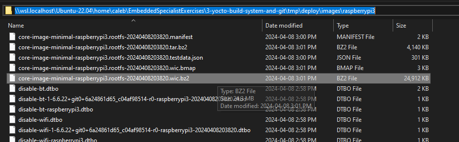
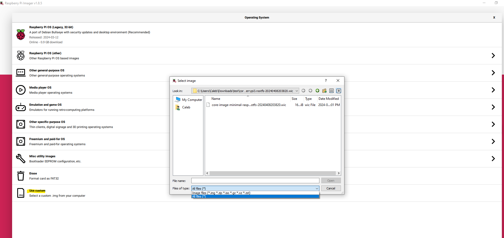
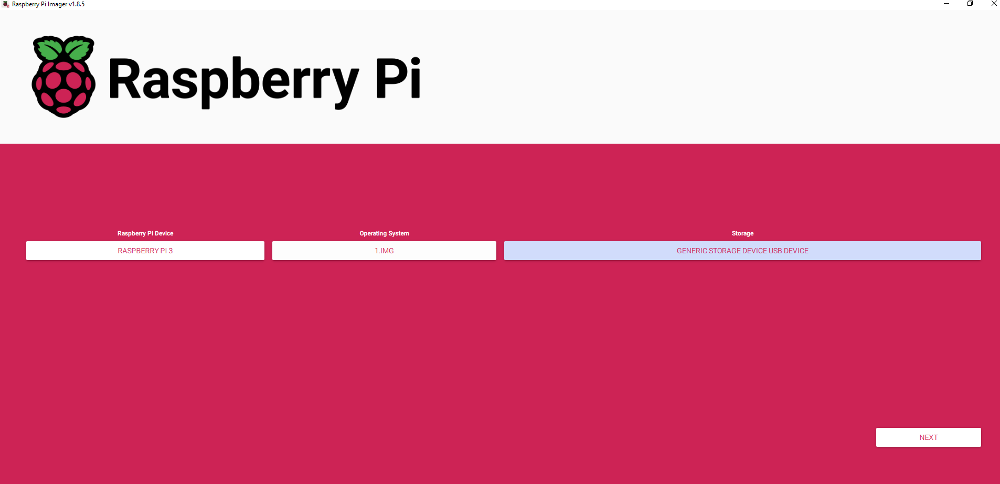

# Exercise: Yocto build system and Git

## Instructions
1. Using resources available online, compile a bootable image for a RaspberryPi board using yocto.
    * You can use any image, minimal is correct
    * You're free to select a version of Yocto
    * You're free to select a version of the target RaspberryPi board
1. Add a new layer that:
    * contains a recipe to compile the bootgen tool from Xilinx for the target RaspberryPi
        * You can use tag 2019.2
    * adds bootgen to the firmware image image.
1. Provide a README in markdown format to describe steps to recompile your new image
    * Objective is that someone that follows the README can rebuild the image with no error

## Deliverables

Use public Git repositories (Github, Gitlab, etc.) to share the yocto layers.

# Solution

## Requirements
* Ubuntu 22.04, or WSL-2 with Ubuntu 22.04
* RaspberryPi
    * Tested using a Raspberry Pi 3 Model B+
* An SD card with at least 8GB of storage
* A USB card reader

## Setup

### 1. Install WSL
You may skip this step if you are already running Ubuntu 22.04.

1. Open an administrator power shell session.
1. Run the command `wsl --install -d Ubuntu-22.04`
1. Enter a username and password when prompted.

When the installation process is complete, a new WSL session will be open in your terminal.

You may now clone the repository in your WSL session.

```bash
git clone git@github.com:tycoontwist/EmbeddedSpecialistExercises.git
```

*Note: You cannot run bitbake from the mounted Windows filesystem. You must clone the repository in your WSL session in order to correctly start the bitbake server.*

Git setup is outside the scope of this exercise.

### 2. Install dependencies
You must install the required host packages on your build machine before we can begin the build process.

First, update your package lists.
```bash
sudo apt-get update
```

Next, install the dependencies.

```bash
sudo apt install gawk wget git diffstat unzip texinfo gcc build-essential chrpath socat cpio python3 python3-pip python3-pexpect xz-utils debianutils iputils-ping python3-git python3-jinja2 libegl1-mesa libsdl1.2-dev python3-subunit mesa-common-dev zstd liblz4-tool file locales libacl1
```

Lastly, set the locale.
```bash
sudo locale-gen en_US.UTF-8
```

### 3. Setup yocto environment
We'll be using the latest yocto release at the time of writing: `scarthgap`. Note this exercise uses git submodules to clone `poky`, the official yocto repository, along with `meta-raspberrypi` and `meta-openembedded`, which are meta layer definitions for the Raspberry Pi. After the setup script is run, a build directory is created which will contain all the files created during the build.

To run the yocto setup script, you will need to initialize the submodules.

Navigate to the poky directory and run the following command.

```bash
git submodule update --init
```

Next, navigate to the root of the `poky` directory and run the setup script; provide the location of the target build directory as an argument. In our case, we would like the build directory in `3-yocto-build-system-and-git`.

```bash
cd ~/poky/

source oe-init-build-env ../3-yocto-build-system-and-git
```

Lastly, the `meta-raspberrypi` and `meta-openembedded` layers have already been added to the `bblayers.conf` file. You can verify this by checking the [conf/bblayers.conf](./conf/bblayers.conf) file in the build directory and ensuring the `BBLAYERS` variable contains the following lines:

```bash
BBLAYERS ?= " \
  ${TOPDIR}/../poky/meta \
  ${TOPDIR}/../poky/meta-poky \
  ${TOPDIR}/../poky/meta-yocto-bsp \
  ${TOPDIR}/../meta-raspberrypi \
  ${TOPDIR}/../meta-openembedded/meta-oe \
  ${TOPDIR}/../meta-openembedded/meta-python \
  ${TOPDIR}/../meta-openembedded/meta-networking \
  ${TOPDIR}/../meta-openembedded/meta-multimedia \
  "
```

We have also modified the `local.conf` file to include the selected machine type as `raspberrypi3`; if you intend to deploy this on a RaspberryPi 4, you will need to change this line to `raspberrypi4`. You can verify this by checking the [conf/local.conf](./conf/local.conf) file in the build directory and ensuring the following lines are present:


```bash
# This is the machine type for raspberry pi. If using version 4, change to raspberrypi4
MACHINE ?= "raspberrypi3"
# MACHINE ?= "raspberrypi4"
```

We also need to accept the license flags for the `synatpics-killswitch`, which is at the bottom of the [conf/local.conf](./conf/local.conf) file.

```bash
LICENSE_FLAGS_ACCEPTED += "synaptics-killswitch"
```

### 4. Build the image
To build the image, run the following command in the `poky` root directory.

```bash
bitbake core-image-minimal
```

The build process will take some time to complete. Once the build is complete, you will find the Linux Image for Raspberry Pi under the `tmp/deploy/images/raspberrypi3` directory.

### 5. Get the image (WSL only)
*Note: You cannot flash the image from the WSL terminal because WSL is a compatibility layer for running Linux binary executables on Windows. It doesn't have direct access to hardware.*

If you built the Raspberry Pi image in WSL, you will need to copy the image to your Windows filesystem before flashing it to an SD card. You can locate the image in your Windows filesystem by opening an explorer window and navigating to the following path:

`\\wsl.localhost\Ubuntu-22.04\home\<USERNAME>\EmbeddedSpecialistExercises\3-yocto-build-system-and-git\tmp\deploy\images\raspberrypi3`

You will need to update `USERNAME` with your WSL username. Once you have located the directory, copy the image to a location on your Windows filesystem.

The generated image file should look like: `core-image-minimal-raspberrypi3.rootfs-<DATETIME>.wic.bz2`




### 6. Extract the image

You will need to first extract the image file before flashing it to an SD card. You can use the `bzzip2` command to extract the image file in Ubuntu, or `7zip` in Windows.

```bash
bzip2 -d -f tmp/deploy/images/raspberrypi3/core-image-minimal-raspberrypi3.rootfs-<DATETIME>.wic.bz2
```

You should extract it down to the image file with the `.wic` extension.


### 7. Flash the Raspberry Pi

To flash the Raspberry Pi, you will need to use the Raspberry Pi Imager tool. You can install the tool on your host machine and use it to flash the image to an SD card.

Install the rpi-imager tool on your host machine. If you are using a native Ubuntu installation, you can install the tool using the following command:

```bash
sudo apt install rpi-imager
```

If your host machine is running Windows, you can download the tool from the [Raspberry Pi website](https://www.raspberrypi.com/software/).


Once the tool is installed, run the Raspberry Pi Imager in Ubuntu using the following command, or clicking the RPi Imager icon in the applications menu.

```bash
rpi-imager
```

Select the `Choose OS` and select `Use custom` option. Navigate to the location where you copied the image file and select it.

*Note: You may need to change the file type filter to `All files` to see the image file.*



For the `Raspberry Pi Device`, select the type of Raspberry Pi you are using. In this case, we are using a Raspberry Pi 3 Model B+.

Lastly, for the `Storage`, select the SD card you would like to flash the image to and click `Next`.

[](assets/rpi-imager.png)

You can optionally set the `Network Options` and `Advanced Options` if you would like to configure the Raspberry Pi before booting it up, such as enabling SSH and providing the Wi-Fi credentials.

### 8. Boot the Raspberry Pi

Once the image has been flashed to the SD card, insert the SD card into the Raspberry Pi and power it on. If the RPi is connected to a monitor, you should see the Raspberry Pi booting up with the Yocto image you built.

Congratulations! You now have a bootable Raspberry Pi image built using Yocto.
