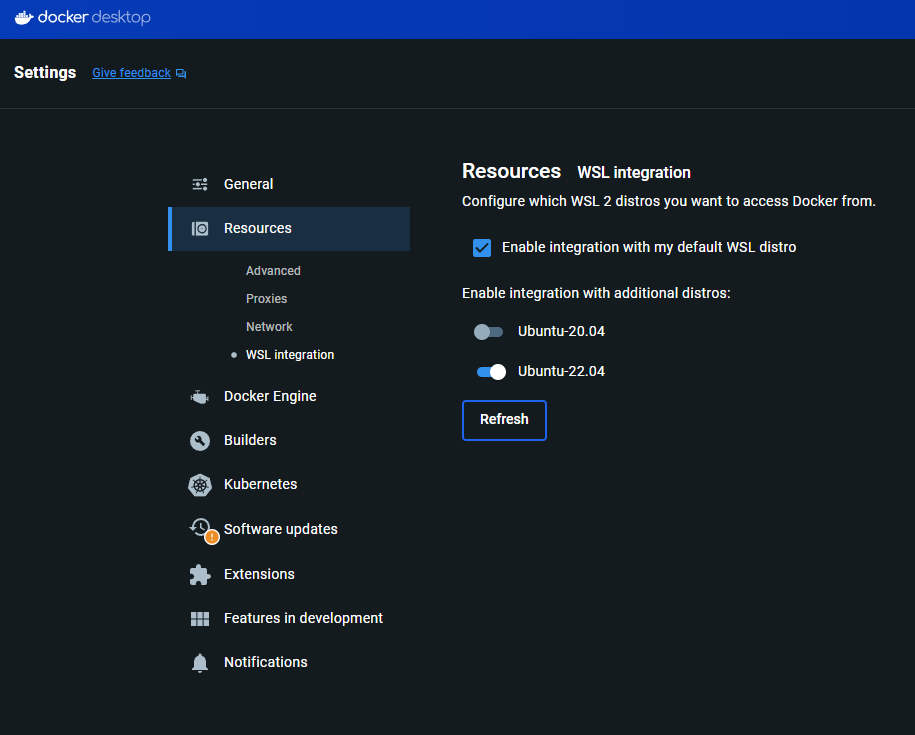

# Exercise: C++ Software application development

## Instructions
1. Provide a Dockerfile that will install all dependencies required to build and execute the program
1. Create the application (client and server) in C++
    * Usage of any open-source 3rd party library is allowed
1. Make the application build and run inside the container
1. Update the Dockerfile to download and install latest aarch64 toolchain from [bootlin](https://toolchains.bootlin.com/releases_aarch64.html)
1. Cross-compile the application for aarch64 using step 4.
1. Provide a README on how to reproduce from step 1. to step 5.
    * Provided in [solution](#solution).

## Deliverables

Use public Git repositories (Github, Gitlab, etc.) to share the source code.

Deliverables MUST build and run successfully based on README instructions (i.e no undocumented step required to make the deliverables run)

# Solution

## Requirements
* Ubuntu 22.04, or WSL-2 with Ubuntu 22.04
* Docker

## Setup

### 1. Install WSL
You may skip this step if you are already running Ubuntu 22.04.

1. Open an administrator power shell session.
1. Run the command `wsl --install -d Ubuntu-22.04`
1. Enter a username and password when prompted.

When the installation process is complete, a new WSL session will be open in your terminal.

You may now clone the repository in your WSL session.

```bash
git clone git@github.com:tycoontwist/EmbeddedSpecialistExercises.git
```

Git setup is outside the scope of this exercise.

### 2. Enable docker
#### Ubuntu 22.04
From the [Docker documentation](https://docs.docker.com/engine/install/ubuntu/), you can install the Docker Engine for the first time on a new host machine using the `apt` repository:

Update the repository:
```bash
# Add Docker's official GPG key:
sudo apt-get update
sudo apt-get install ca-certificates curl
sudo install -m 0755 -d /etc/apt/keyrings
sudo curl -fsSL https://download.docker.com/linux/ubuntu/gpg -o /etc/apt/keyrings/docker.asc
sudo chmod a+r /etc/apt/keyrings/docker.asc

# Add the repository to Apt sources:
echo \
  "deb [arch=$(dpkg --print-architecture) signed-by=/etc/apt/keyrings/docker.asc] https://download.docker.com/linux/ubuntu \
  $(. /etc/os-release && echo "$VERSION_CODENAME") stable" | \
  sudo tee /etc/apt/sources.list.d/docker.list > /dev/null
sudo apt-get update
```

Install Docker Engine:
```bash
sudo apt-get install docker-ce docker-ce-cli containerd.io docker-buildx-plugin docker-compose-plugin
```

#### WSL-2
Download [Docker Desktop](https://qubitpi.github.io/docker-docs/desktop/install/windows-install/) for Windows.

When you have the application running:
1. Open your settings
1. Select resources
1. Select WSL integration
1. Enable the WSL integration for the Ubuntu 22.04 distribution.
1. Select Apply & Restart to enable the integration

[](assets/wsl-integration.png)

## Build
To build the application, you must first build the Docker image.

```bash
docker build --build-arg GIT_HASH=$(git rev-parse HEAD) -t application .
```

This command will build the Docker image with the name `application`.

Notice we pass in the build argument `GIT_HASH` to the Docker build command. This argument is passed to the compiler as an environment variable which is then used by the application when the `client` requests the `version` from the `server`.

If we were to build the client/server locally, we could grab the git hash in the Makefile and pass it to the compiler. Since a Docker container is a totally isolated environment, it has no concept of git and the git-hash from which it was built, so we need to pass it as an argument.

The [Makefile](./server_data/Makefile) is set up to use the `GIT_HASH` environment variable to pass the git hash to the compiler from the Dockerfile, but we could uncomment the line in the Makefile and pass the git hash directly to the compiler.

## Run
To run the application, you must first run the Docker container.

```bash
sudo docker run -it application /bin/bash
```

The above command will run the previously-built image called `application` and connect you to the bash shell inside the container.

Once inside the container, you can start the server as a background process in the container.
```bash
./server /tmp/socket &
```

Then you can use the client to pass a command to the server.
```bash
./client /tmp/socket version
```

The client will send the command `version` to the server, and the server will respond with the git hash that was passed to the compiler when the application was built. The command is not case sensitive, so you can send an uppercase or lowercase command.

If an invalid command is received, the server will respond with `REJECTED`.
If the server has not been started and you attempt to connect and send a command, the client will respond with:
```
Failed to connect to socket <NAME OF SOCKET>
```

## Logs
The client and server have independent logs and are written to the `logs` directory as `server_logs.log` and `client_logs.log`.

## Cross-compile
The container has downloaded, extracted, and installed the latest (stable) aarch64 toolchain from [bootlin](https://toolchains.bootlin.com/releases_aarch64.html), which is `2024.02-1`.

The container will pre-build the application for the host machine, but you can optionally cross-compile for aarch64 using the following commands from the root of the app:

```bash
make clean
make all_cross_compile
```

The output is a `server` and `client` binary that can be run on an aarch64 machine.

If you need to switch back to the host machine, simply clean and rebuild.

```bash
make clean
make all
```

# Other Considerations
The following are some things that could be improved on, given more time to work on the exercise:
* Gracefully close the server socket when the client sends a `quit` command.
* Move the client and server socket logic to a class object and sub-class for the client and server.
* Address compiler warning:
  * Logger formatting is not a string literal and a security risk.
